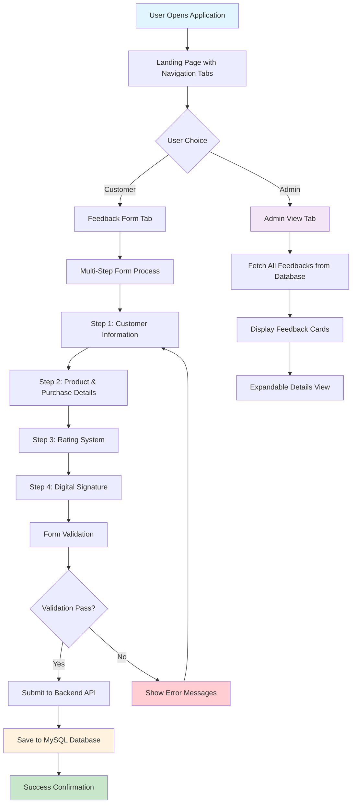

# Customer Feedback Form - Application Workflow

## 📋 Overview

This document provides a comprehensive overview of how the Customer Feedback Form application works, including user journeys, data flow, and technical architecture.

---

## 🔄 Application Workflow Diagram



---

## 👤 User Journeys

### **1. Customer Journey**

#### **Step-by-Step Process:**
1. **Landing Page**
   - User opens the application
   - Sees two tabs: "Feedback Form" and "Admin View"
   - Clicks "Feedback Form" tab

2. **Step 1: Customer Information**
   - Enter full name (required)
   - Enter email address (required, validated format)
   - Enter phone number (required, validated format)
   - Form validates all fields before proceeding

3. **Step 2: Product & Purchase Details**
   - View purchase date (auto-filled, read-only)
   - Select purchased products from checkboxes:
     - Shirt, Pants, Dress, Jacket, Shoes, Accessories
   - Provide optional feedback text
   - Must select at least one product to proceed

4. **Step 3: Rating System**
   - Rate product quality (1-5 stars)
   - Rate staff friendliness (1-5 stars)
   - Rate overall experience (1-5 stars)
   - All ratings are required

5. **Step 4: Digital Signature**
   - Draw signature using HTML5 Canvas
   - Clear signature option available
   - Signature preview shown after drawing
   - Signature is required to proceed

6. **Submission Process**
   - All data validated
   - Form submitted to backend API
   - Success confirmation page displayed

### **2. Admin Journey**

#### **Dashboard Access:**
1. **Admin View Tab**
   - Click "Admin View" tab
   - System fetches all feedbacks from database
   - Displays feedbacks in card format

2. **Feedback Display**
   - Each feedback shown as a card with:
     - Customer name
     - Purchase date
     - Selected products
     - Star ratings (visual representation)
   - Cards are responsive and organized in grid

3. **Detailed View**
   - Click "See More" to expand card
   - View complete feedback including:
     - Full customer details (email, phone)
     - Complete feedback text
     - Signature image
   - Click "See Less" to collapse

---

## 🔧 Technical Architecture

### **Frontend Architecture**

#### **State Management (Redux)**
```javascript
// Redux Store Structure
{
  feedback: {
    step: 0,                    // Current form step (0-3)
    full_name: '',              // Customer name
    email: '',                  // Customer email
    phone: '',                  // Customer phone
    purchase_date: '',          // Purchase date (auto-filled)
    products: [],               // Array of selected products
    feedback: '',               // Customer feedback text
    rating_quality: 0,          // Quality rating (1-5)
    rating_staff: 0,            // Staff rating (1-5)
    rating_experience: 0,       // Experience rating (1-5)
    signature: '',              // Base64 signature image
    submitted: false            // Form submission status
  }
}
```


### **Backend Architecture**

#### **API Endpoints**
```javascript
// Submit new feedback
POST /feedback
Request Body: {
  full_name: string,
  email: string,
  phone: string,
  purchase_date: string,
  products: string,
  feedback: string,
  rating_quality: number,
  rating_staff: number,
  rating_experience: number,
  signature: string (base64)
}

// Get all feedbacks (admin)
GET /feedback/admin
Response: Array of feedback objects
```

#### **Database Operations**
```javascript
// Create new feedback
INSERT INTO feedbacks (full_name, email, phone, purchase_date, products, feedback, rating_quality, rating_staff, rating_experience, signature) VALUES (?, ?, ?, ?, ?, ?, ?, ?, ?, ?)

// Retrieve all feedbacks
SELECT * FROM feedbacks ORDER BY id DESC
```

---

## 🔄 Data Flow

### **1. Form Submission Flow**
```
User Input → React State → Redux Store → API Call → Express Server → MySQL Database
```

### **2. Admin Data Retrieval Flow**
```
Admin Request → API Call → Express Server → MySQL Query → Database Response → Frontend Display
```

### **3. State Management Flow**
```
User Action → Redux Action → Redux Reducer → Component Re-render → UI Update
```

---

## ✅ Validation & Error Handling

### **Form Validation Rules**

#### **Step 1: Customer Information**
- Full name: Required, non-empty string
- Email: Required, valid email format
- Phone: Required, minimum 10 digits

#### **Step 2: Product Selection**
- At least one product must be selected
- Purchase date is auto-filled and read-only

#### **Step 3: Ratings**
- All three ratings (quality, staff, experience) are required
- Ratings must be between 1-5

#### **Step 4: Signature**
- Signature must be drawn (not empty canvas)
- Signature is captured as base64 image


---


This workflow document provides a comprehensive understanding of how the Customer Feedback Form application operates, from user interaction to data persistence and everything in between. 